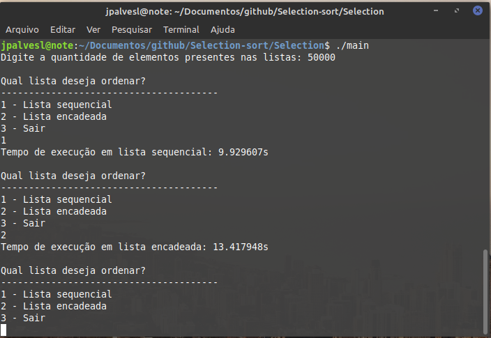
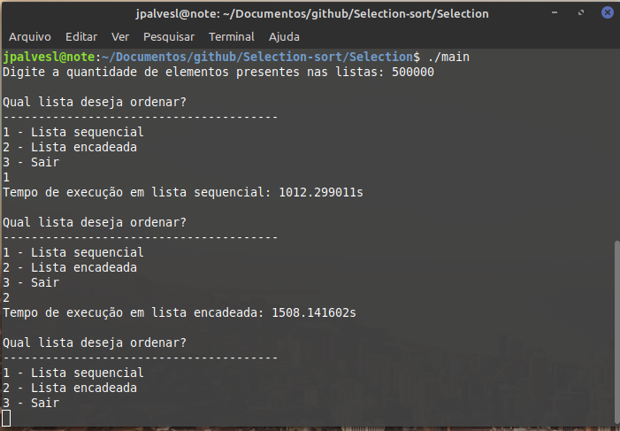

# Selection sort
Projeto da disciplina de Estrutura de dados

Sobre o algoritimo [Selection Sort](https://pt.wikipedia.org/wiki/Selection_sort)

🚀 Início rápido

1. **Clonar o repositório**  
  Use o comando a seguir para isso
```shell
git clone https://github.com/jpalvesl/Selection-sort.git
```

2. **Navegue até a pasta com os arquivos fonte**  

```shell
cd src
```

3. **Compile os arquivos**  
  ```shell
  gcc main.c selection.c selection.h -o main
  ```

4. **Execute o main** 
  ```shell
  ./main
  ```

# 🧐 O que é usado?
- stdio.h
- stdlib.h
- stdbool.h
- time.h

## Exemplos de uso
* Tempo de execução para 50 mil elementos

* Tempo de execução apra 500 mil elementos

